# 向微信推送定时消息

[](https://hub.docker.com/repository/docker/hollowman6/send-message-to-wechat)

[](https://github.com/HollowMan6/Wechat-Timed-Message/graphs/commit-activity)
[](https://artifacthub.io/packages/search?repo=wechat-timed-message)
[](https://github.com/HollowMan6/Wechat-Timed-Message/releases)


[](https://github.com/HollowMan6?tab=followers)
[](https://github.com/HollowMan6/Wechat-Timed-Message/watchers)
[](https://github.com/HollowMan6/Wechat-Timed-Message/stargazers)
[](https://github.com/HollowMan6/Wechat-Timed-Message/network/members)

[](https://hollowman6.github.io/fund.html)
[](https://opensource.org/licenses/GPL-3.0/)
[](https://github.com/HollowMan6/Wechat-Timed-Message/archive/master.zip)

[](https://lgtm.com/projects/g/HollowMan6/Wechat-Timed-Message/alerts/)
[](https://lgtm.com/projects/g/HollowMan6/Wechat-Timed-Message/context:python)
[](https://microbadger.com/images/hollowman6/send-message-to-wechat)

(English version is down below)

源Github项目地址：https://github.com/HollowMan6/Wechat-Timed-Message

### 好用记得收藏(右上角**加星★Star**)哦!

[微信消息推送脚本](Wechat-Timed-Message.py)

[工作流存放文件夹](.github/workflows)

支持[Fork本仓库直接使用工作流(推荐)](#使用方法)，[GitLab使用Pipeline](#gitlab)，[自行创建仓库使用工作流](#自行配置工作流)，[CronTab/Python后台定时调度运行](#crontab)，[Docker运行](#docker)，[Kubernetes直接运行](#kubernetes)，[使用Helm包管理在Kubernetes运行](#helm)，[Heroku部署运行](#heroku)等。

[Docker镜像](https://hub.docker.com/r/hollowman6/send-message-to-wechat)支持在`amd64`、`arm64`、`arm32v7`、`arm32v6`、`ppc64le`、`s390x`、`i386`多架构(包括大型机、普通PC机以及树莓派等开发板)运行。

## 使用方法

你需要fork本仓库，之后在你fork的仓库中创建相关Actions Secret并进行相关设置(按下图所示点击1，2，3的次序，即可进入新建Actions secrets的界面):

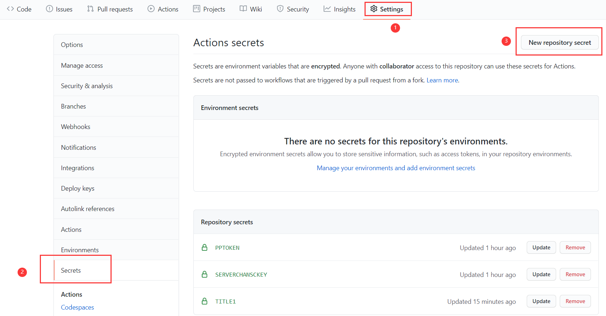

你可以从以下三个推送平台中任选一个或多个来接受推送的消息：

### PushPlus(推荐)

[登录PushPlus](https://www.pushplus.plus/login)，然后在pushplus网站中找到您的token，创建一个Name为`PPTOKEN`，value为您的token值的Actions secret，就可以进行一对一推送信息。

如果需要对多个账号推送信息，即一对多推送，还需要另外新建一个群组，记下群组编码，然后创建一个Name为`PPTOPIC`，value为您的群组编码的Actions secret。

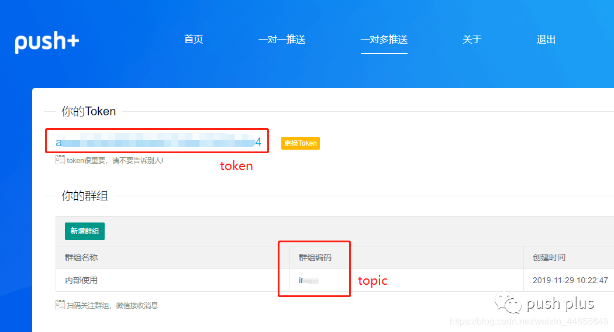

#### 企业微信推送 

1. 首先注册[企业微信](https://work.weixin.qq.com/wework_admin/loginpage_wx)。
2. 注册成功后，获取企业id，创建一个Name为`CORPID`，value为您的企业id值的Actions secret。

3. 选择`应用管理` → `应用` → `创建应用`

4. 自己创建完成后获取Secret和AgentId，创建分别Name为`CORPSECRET`和`AGENTID`，value为这些值的Actions secret。
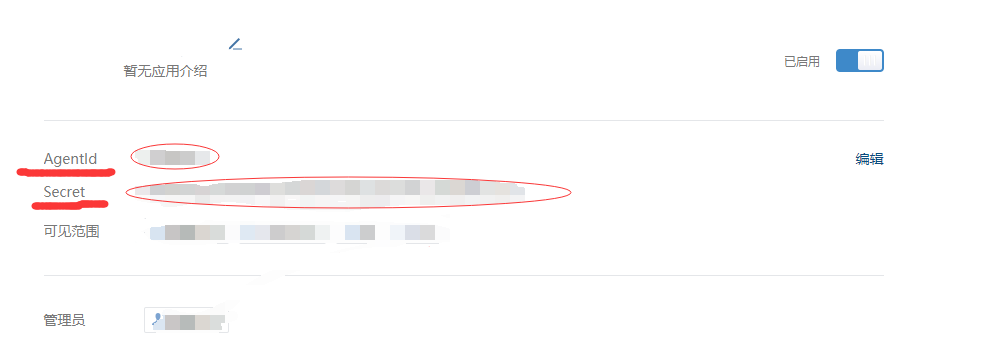
5. 进入`我的企业` → `微信插件`，拉到下边扫描二维码，关注以后即可收到推送的消息。


效果示意:

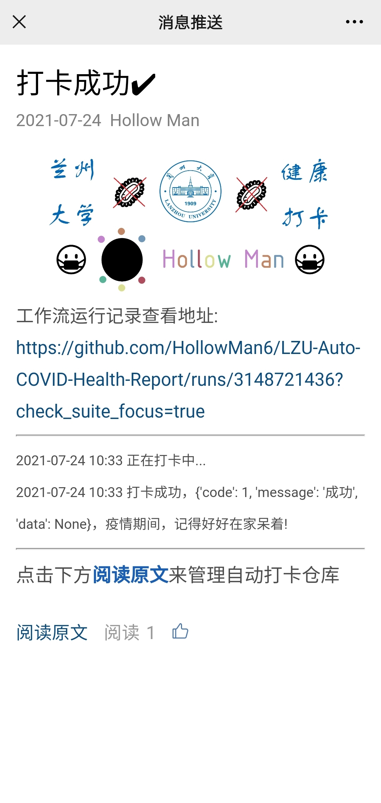
[示例内容](https://open.work.weixin.qq.com/wwopen/mpnews?mixuin=pHhNDQAABwCobsHiAAAUAA&mfid=WW0324-8tTQjQAABwBCZs6oZBo1yA3mwAO57&idx=0&sn=4f42d0909560e8b42dd756d0ac1b04b6)

### Server酱

如果要使用[Server酱](https://sct.ftqq.com/)，请创建一个/修改Name为`SERVERCHANSCKEY`，value为[你的SendKey值](https://sct.ftqq.com/sendkey)的Actions secret。

---

上述配置成功后，配置工作流文件，以[工作流1.yml](.github/workflows/1.yml)为模板，创建你自己的工作流或者在提供的工作流上进行修改。你可以任意更改name为无空格的英文字母和数字组合的字符串，cron为你想要发送消息的指定时间(你可以使用[crontab guru](https://crontab.guru/)进行cron表达式的调试，所有时间均为UTC时间，请进行时区换算)(因为Github方的原因，预定运行时间可能会有半小时左右的延迟)。然后创建一个或者两个Actions secrets，一个必须创建，其name为`TITLE[name]`（请将这里的`[name]`修改为workflow的name），value为要发送消息的标题，例如在提供的工作流中，这里的name为`TITLE1`；另一个为可选的，其name为`MSG[name]`，同理进行相应的替换，value为要发送消息的标题。

随后，按下图所示点击1，2，3，4的次序，你可以手动触发工作流的执行来进行测试。
   
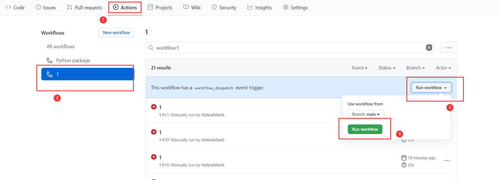

点开任意一个运行记录，依次点开下图所示1，2，你可以看到运行记录。

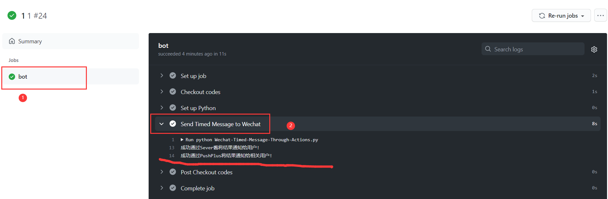

如果某次因为某些因素工作流运行失败，GitHub会自动发邮件提醒工作流运行失败。

**新**：增加可选的遇到发送消息失败的情况，自动重启工作流，并等待一段时间后再次发送消息。如果你需要这个功能，则请创建一个Personal Access Token, [获取教程](https://docs.github.com/cn/github/authenticating-to-github/creating-a-personal-access-token#creating-a-token)(第7步令牌的作用域权限你只需要选中workflow这一栏即可)。然后创建一个Name为`GPATOKEN`，value为你的令牌值的Actions Secret。

默认再次发送消息等待时间为30分钟，如果你有需要可以修改你的fork仓库对应的[这里](
https://github.com/HollowMan6/Wechat-Timed-Message/blob/main/.github/workflows/1.yml#L43)的`30m`替换为你想要的数值，这里的时间遵循Linux sleep 函数对应时间语法：一个数字后接 `s` 对应秒, `m` 对应分钟等。

如果是因为本仓库程序本身因为失效而导致的报错，你可以取消正在运行中的工作流从而终止这一循环。

## GitLab

GitLab仓库地址：https://gitlab.com/HollowMan6/Wechat-Timed-Message

你还可以使用GitLab的Pipeline来进行消息推送：

同理，fork完GitLab仓库到你的名下后，创建Variables（类似于GitHub Actions Secrets）：

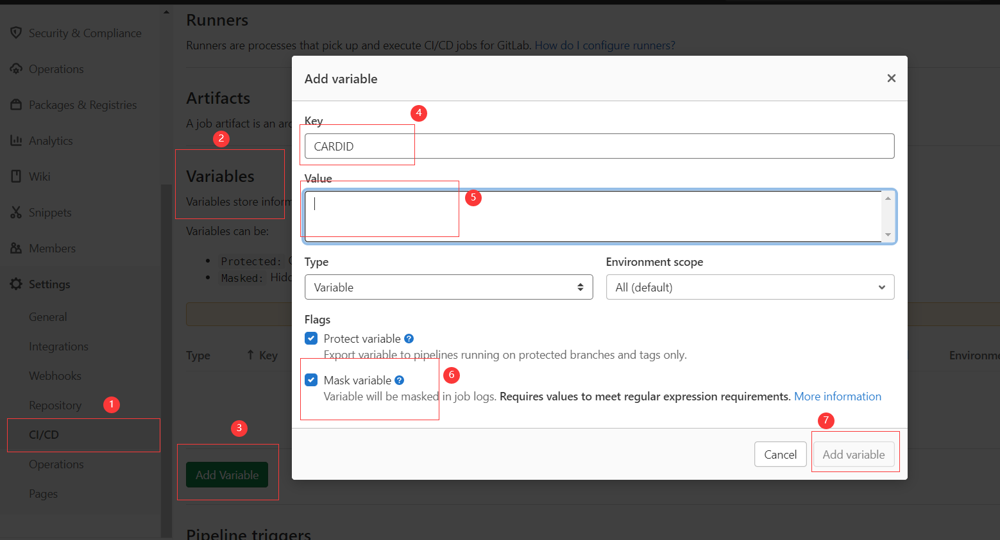

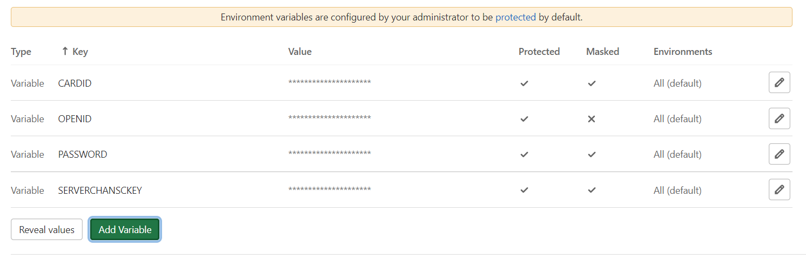

同理，你还可以创建一个Pipeline triggers(类似于Github Access Token)并加入到Variables中来启用自动打开失败再次消息推送：

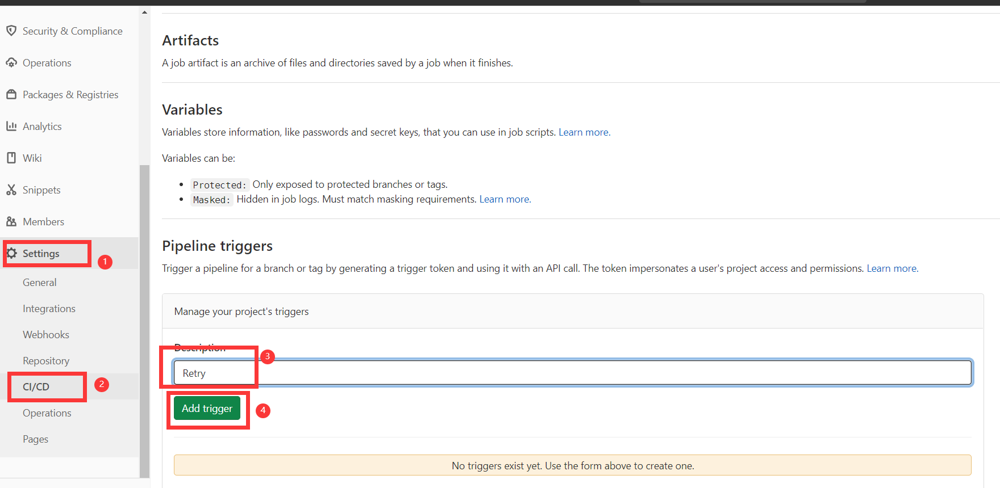

默认再次消息推送等待时间为30分钟，如果你有需要可以修改你的fork仓库对应的[这里](.gitlab-ci.yml#L49)的`30m`替换为你想要的数值。

设定schedule：

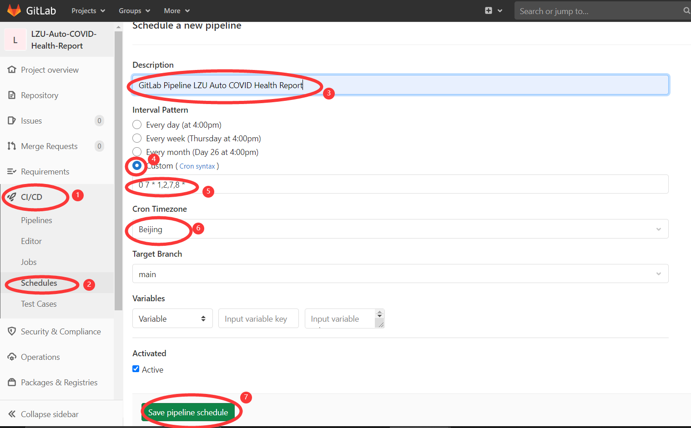

## 自行配置工作流

你可以自行创建一个仓库并自行配置工作流进行使用，[示例工作流文件](.github/workflows/1-docker.yml)

### 输入

#### 必须

* TITLE: 消息标题

#### 可选

* MSG: 消息主体
* DELAYS: 设置发送消息时间延迟
* SERVERCHANSCKEY: Server酱 SCKEY
* PPTOKEN: PushPlus Token
* PPTOPIC: PushPlus 群组编码
* CONTENT: 企业微信推送详细信息内容（必须和IMAGE同时存在）
* IMAGE: 企业微信推送要使用的图片（必须和CONTENT同时存在）
* CORPID: Wecom Corporation ID
* CORPSECRET: Wecom Corporation App Secret
* AGENTID: Wecom Corporation App Agent ID

### 示例

```yaml
- name: 'Send Message to Wechat'
  uses: HollowMan6/Wechat-Timed-Message@main
  with:
    DELAYS: ${{ github.event.inputs.delays }}
    SERVERCHANSCKEY: ${{ secrets.SERVERCHANSCKEY }}
    PPTOKEN: ${{ secrets.PPTOKEN }}
    PPTOPIC: ${{ secrets.PPTOPIC }}
    TITLE: ${{ secrets.TITLE }}
    MSG: ${{ secrets.MSG }}
    CONTENT: ${{ secrets.CONTENT }}
    IMAGE: ${{ secrets.IMAGE }}
    CORPID: ${{ secrets.CORPID }}
    CORPSECRET: ${{ secrets.CORPSECRET }}
    AGENTID: ${{ secrets.AGENTID }}
```

## Docker

Docker Hub 仓库: https://hub.docker.com/r/hollowman6/send-message-to-wechat

如果你需要通过Docker运行，只需要将上述Actions Secret变量名和值分别设置为环境变量(另外增加一个DELAYS为发送消息等待时间，值同[使用方法](#使用方法)步骤6中要求)，然后执行下述命令即可：
```bash
docker run -it \
    -e TITLE="$TITLE" \
    -e MSG="$MSG" \
    -e DELAYS=$DELAYS \
    -e SERVERCHANSCKEY=$SERVERCHANSCKEY \
    -e PPTOKEN=$PPTOKEN \
    -e PPTOPIC=$PPTOPIC \
    -e CONTENT=$CONTENT \
    -e IMAGE=$IMAGE \
    -e CORPID=$CORPID \
    -e CORPSECRET=$CORPSECRET \
    -e AGENTID=$AGENTID \
    hollowman6/send-message-to-wechat
```

**创建**

```bash
docker build -t hollowman6/send-message-to-wechat .
```

该Docker镜像也可以在云服务器中结合Kubernetes的CronJob运行等，可能性无限多。

## CronTab

*注:* 如要在自己的Linux服务器上使用crontab执行定时任务来进行自动发送消息，推荐使用[Docker](#docker)。你也可以clone本仓库，安装好相关Python依赖后改编[entrypoint.sh](entrypoint.sh)文件中python程序的路径，将上述Actions Secret变量名和值分别设置为系统环境变量(另外增加一个DELAYS为发送消息等待时间，值同[使用方法](#使用方法)步骤6中要求)，即可运行。

你还可以将上述Actions Secret变量名和值分别设置为系统环境变量后，另外增加一个DELAYS为等待时间，值同[使用方法](#使用方法)步骤6中要求，再增加一个CRONEXP为Cron表达式存储定时调度时间，然后后台运行`python clock.py`。这里为了方便使用，我制作了[安装配置shell脚本](install.sh)，你可以直接运行该脚本，输入相关信息后即可在后台定时运行脚本。

如果你使用的是Windows，你可以将本仓库切换到[windows分支](../../tree/windows)，然后使用PowerShell运行[`run.ps1`](../../blob/windows/run.ps1)即可。

## Kubernetes

参考配置文件见[K8s](K8s), 只要运行[create.sh](K8s/create.sh)即可创建相关Actions Secret、ConfigMap和CronJob。

你可以[更改这里来设定DELAYS变量](K8s/Wechat-Timed-Message.yml#L6)

还可以[更改这里来设定Cron表达式](K8s/Wechat-Timed-Message.yml#L15)

## Helm

Artifact Hub: https://artifacthub.io/packages/helm/wechat-timed-message/wechat-timed-message

你可以[参考这里](helmChart/wechat-timed-message/values.yaml)来自定义一些values值。

### V3
#### [在线安装脚本(推荐使用)](helmChart/install-online.sh)

脚本会提示你输入相关Secrets和schedule(cron表达式)，并且会自动创建一个名为`wechat-timed-message`的Kubernetes namespace，并将Helm Charts安装在其中。

参考命令：

```bash
kubectl create ns wechat-timed-message
helm repo add Wechat-Timed-Message http://hollowman.ml/Wechat-Timed-Message
helm install wechat-timed-message Wechat-Timed-Message/wechat-timed-message --namespace wechat-timed-message --set title='[你的消息标题]' --set message='[你的消息内容]' --set '[...]'
```

#### 从仓库安装

参考命令：

```bash
kubectl create ns wechat-timed-message
cd helmChart/wechat-timed-message
helm install wechat-timed-message . --namespace wechat-timed-message --set title='[你的消息标题]' --set message='[你的消息内容]' --set '[...]'
```

#### 卸载

删除helm chart release:

```bash
helm uninstall wechat-timed-message --namespace wechat-timed-message
```

删除相关Kubernetes namespace:

```bash
kubectl delete ns wechat-timed-message
```

## Heroku

[](https://dashboard.heroku.com/new?template=https://github.com/HollowMan6/Wechat-Timed-Message)

点击以上按钮部署成功后，请确保Overview中Dyno formation栏目中的clock为ON状态，如果不是请按开启：
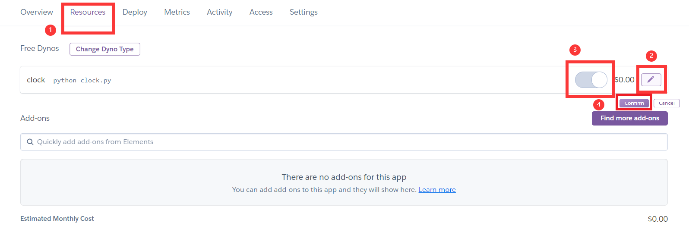

因为Free Dyno 30分钟会自动休眠，实测休眠时不会自动唤醒消息推送，因而建议使用付费版，否则不推荐使用。

**警告**：

***仅供测试使用，不可用于任何非法用途！***

***对于使用本代码所造成的一切不良后果，本人将不负任何责任！***

# Send timed message to Wechat

Source Github Repository Link: https://github.com/HollowMan6/Wechat-Timed-Message

### Please **★Star** if you think it's great!

[Python library dependency](https://github.com/HollowMan6/Wechat-Timed-Message/network/dependencies)

[Workflows](.github/workflows)

Support [Fork this repository to use workflows(Recommend)](#usage)，[GitLab using Pipeline](#gitlab)，[Self-Configure Workflow](#self-configure-workflow)，[run using CronTab / Python schedule](#crontab)，[run with Docker](#docker)，[run with Kubernetes directly](#kubernetes), [Use Helm Package Manager to run in Kubernetes](#helm), [use Heroku to deploy](#heroku) etc.

[Docker Image](https://hub.docker.com/r/hollowman6/send-message-to-wechat) support running on multiple architectures such as `amd64`, `arm64`, `arm32v7`, `arm32v6`, `arm32v5`, `ppc64le`, `s390x`, `i386` including Mainframe, PC and Demoboard like Raspberry Pi.

## Usage

you can fork this repository first, and then create Actions Secrets and set related settings in your forked repository (click in the order of 1, 2 and 3 as shown in the figure below).


You can choose one or more of the following three push platforms to receive pushed messages:

### PushPlus(Recommended)

First [log into pushplus](https://www.pushplus.plus/push1.html), and then find your token in pushplus website, create a actions secret with the name of `PPTOKEN` and the value of your token value, and then one-to-one push the related information results.

If you need to push the related information to multiple Wechat accounts, that is, one-to-many push, you need to create a group, write down the group code, and then create an actions secret with the name of `PPTOPIC` and the value of your group code.


#### Wecom push by Wechat 

1. First register [Wecom](https://work.weixin.qq.com/wework_admin/loginpage_wx).
2. After successful registration, obtain the Company ID and create an actions secret with the name of `CORPID` and the value of your Company ID.

3. Select `App Management` → `Apps` → `Create an app`.

1. After the creation, obtain the secret and AgentId, and create actions secret with the name of `CORPSECRET` and `AGENTID` and the value of these values respectively. 

1. Enter `My Company` → `WeChat Workplace`, pull to the bottom and scan the QR code. After following, you can receive the push message.


Demo:


[Example Content](https://open.work.weixin.qq.com/wwopen/mpnews?mixuin=pHhNDQAABwCobsHiAAAUAA&mfid=WW0324-8tTQjQAABwBCZs6oZBo1yA3mwAO57&idx=0&sn=4f42d0909560e8b42dd756d0ac1b04b6)

### ServerChan

If you want to use [ServerChan](https://sct.ftqq.com/), please create/modify the Actions secret with the Name `SERVERCHANSCKEY` and the value [your sendkey value](https://sct.ftqq.com/sendkey).

---

After the above configuration is successful, configure the workflow file and use [工作流1.yml](.github/workflows/1.yml) as the template to create your own workflow or modify the workflow provided. You can change the name into a string of letters or numbers without spaces. Cron is the specified time when you want to send a message (you can use [crontab guru](https://crontab.guru/) For cron expression debugging, all the time zone is in UTC, please convert the time zone into yours. (Due to the mechanism realized by Github, there may exist a delay for about half an hour.) Then create one or two actions Secrets: one must be created, its name is`TITLE[name]`(please change `[name]` here into the name of workflow), and value is the title of the message to be sent. For example, in the provided workflow, the name is `TITLE1`; the other is optional, its name is `MSG[name]`, and the corresponding replacement is carried out, and value is the title of the message to be sent.

Then, click in the order of 1, 2, 3 and 4 as shown in the figure below. You can manually trigger the execution of workflow to test.


Click any running record, and then click in the order of 1 and 2 as shown in the figure below. You can see the running record and error description.


If the workflow fails due to some errors, GitHub will automatically send an email to remind the workflow of failure.

**NEW**: Add the optional option to restart the workflow automatically in case of Send Message to Wechat in failure, and wait for a period of time to re-run workflow again automatically. If you need this, please create a Personal Access Token, [Here's Guides to create](https://docs.github.com/en/github/authenticating-to-github/creating-a-personal-access-token#creating-a-token)(In step 7 scopes or permissions, you only need to select the `workflow` row). Then create an Actions Secret with the name of `GPATOKEN` and the value with your token.

The default waiting time is 30 minutes. You can replace `30m` [here](
https://github.com/HollowMan6/Wechat-Timed-Message/blob/main/.github/workflows/1.yml#L43) in your corresponding repository with the time you want. The time here follows the Linux sleep syntax for time units: a number followed by `s` for seconds, `m` for minutes, etc.

If the error is caused by the repository program itself, you can cancel the running workflow to terminate the loop.

## GitLab

GitLab Repository Address：https://gitlab.com/HollowMan6/Wechat-Timed-Message

You can also use GitLab's Pipeline to auto-report：

In the same way, after forking the gitlab repository under your account, create Variables（similar to GitHub Actions Secrets）:


In the same way, you can also create a Pipeline triggers (similar to Github Access Token) and add it to Variables to restart the workflow automatically in case of Auto Report in failure：


The default waiting time is 30 minutes. You can replace `30m` [here](.gitlab-ci.yml#L49) in your corresponding repository with the time you want. 

Setup schedule：


## Self-Configure Workflow

You can create your own repository and configure your own workflow to use, [Example Workflow YAML File](.github/workflows/1-docker.yml)

### Input

#### Required

* TITLE: Your Message Title

#### Optional

* MSG: Your Message Content
* SERVERCHANSCKEY: ServerChan SCKEY
* PPTOKEN: PushPlus Token
* PPTOPIC: PushPlus Topic
* CONTENT: Wecom Push Detailed Content (Must Coexist with IMAGE)
* IMAGE: Wecom Push Cover Image (Must Coexist with CONTENT)
* CORPID: Wecom Corporation ID
* CORPSECRET: Wecom Corporation App Secret
* AGENTID: Wecom Corporation App Agent ID

### Example

```yaml
- name: 'Send Message to Wechat'
  uses: HollowMan6/Wechat-Timed-Message@main
  with:
    DELAYS: ${{ github.event.inputs.delays }}
    SERVERCHANSCKEY: ${{ secrets.SERVERCHANSCKEY }}
    PPTOKEN: ${{ secrets.PPTOKEN }}
    PPTOPIC: ${{ secrets.PPTOPIC }}
    TITLE: ${{ secrets.TITLE }}
    MSG: ${{ secrets.MSG }}
    CONTENT: ${{ secrets.CONTENT }}
    IMAGE: ${{ secrets.IMAGE }}
    CORPID: ${{ secrets.CORPID }}
    CORPSECRET: ${{ secrets.CORPSECRET }}
    AGENTID: ${{ secrets.AGENTID }}
```

## Docker

Docker Hub Repository: https://hub.docker.com/r/hollowman6/send-message-to-wechat

If you need to run through docker, just set the above Actions Secrets name and value as environment variables (In addition, add a DELAYS as the waiting time, and the value is the same requirement as that in step 6 of [usage](#usage)), and then execute the following command:

```bash
docker run -it \
    -e TITLE="$TITLE" \
    -e MSG="$MSG" \
    -e DELAYS=$DELAYS \
    -e SERVERCHANSCKEY=$SERVERCHANSCKEY \
    -e PPTOKEN=$PPTOKEN \
    -e PPTOPIC=$PPTOPIC \
    -e CONTENT=$CONTENT \
    -e IMAGE=$IMAGE \
    -e CORPID=$CORPID \
    -e CORPSECRET=$CORPSECRET \
    -e AGENTID=$AGENTID \
    hollowman6/send-message-to-wechat
```

**Build**

```bash
docker build -t hollowman6/send-message-to-wechat .
```

The docker image here can also be runned in combination with Kubernetes' CronJob in the Cloud Clusters etc. THere're unlimited possibilities.

## CronTab

*PS:* If you want to use crontab on your own Linux server to execute the send message, I recommend using [docker](#docker), otherwise please clone this repository and after installing relevant Python dependencies, adapt the path of the python program in [entrypoint.sh](entrypoint.sh). Set the Actions Aecrets name and value mentioned above as the environment variable respectively (In addition, add a DELAYS as the waiting time, and the value is the same requirement as that in step 6 of [usage](#usage)) to run.

You can also set the Actions Secrets name and value mentioned above as the environment variable respectively, in addition, add a DELAYS as the waiting time, and the value is the same requirement as that in step 6 of [usage](#usage), and add a CRONEXP as the schedule time, the value being the cron expression. Finally run `python clock.py` in the background. Here, for the convenience of use, I made a [install and configure shell script](install.sh). you can run the script directly, and then the program will run and schedule in the background after inputting relevant information.

If you use Windows, you can switch this repository into [branch `windows`](../../tree/windows), then use PowerShell to run [`run.ps1`](../../blob/windows/run.ps1).

## Kubernetes

You can refer to the configuration file [K8s](K8s).Also create the relevant Secrets ConfigMap and CronJob by running [create.sh](K8s/create.sh)

You can also [change here to set `DELAYS` Variable](K8s/Wechat-Timed-Message.yml#L6)

Also [change here to set Cron expression](K8s/Wechat-Timed-Message.yml#L15)

## Helm

Artifact Hub: https://artifacthub.io/packages/helm/wechat-timed-message/wechat-timed-message
You can [refer to here](helmChart/wechat-timed-message/values.yaml) to customize some values.

### V3
#### [Online Install Script(Recommend)](helmChart/install-online.sh)

The script will prompt users to enter the Secrets and schedule (cron expression), and automatically created a Kubernetes namespace called `wechat-timed-message`, and install Helm Charts into it.

Example command:

```bash
kubectl create ns wechat-timed-message
helm repo add Wechat-Timed-Message http://hollowman.ml/Wechat-Timed-Message
helm install wechat-timed-message Wechat-Timed-Message/wechat-timed-message --namespace wechat-timed-message --set title='[Your Message Title]' --set message='[Your Message Content]' --set '[...]'
```

#### From Repository

Example command:

```bash
kubectl create ns wechat-timed-message
cd helmChart/wechat-timed-message
helm install wechat-timed-message . --namespace wechat-timed-message --set title='[Your Message Title]' --set message='[Your Message Content]' --set '[...]'
```

#### Uninstall

Delete helm chart release:

```bash
helm uninstall wechat-timed-message --namespace wechat-timed-message
```

Delete related Kubernetes namespace:

```bash
kubectl delete ns wechat-timed-message
```

## Heroku

[](https://dashboard.heroku.com/new?template=https://github.com/HollowMan6/Wechat-Timed-Message) 

After sccessfully deployed the app, please make sure that the clock is ON at Dyno formation part in the Overview Section. If it's not, turn it on:


Because Free Dyno will automatically sleep in 30 minutes, it will not automatically wake up even the specified time arrives when it sleeps, so it is recommended to use the paid Dyno, otherwise is not recommended.

**Warning**:

***For TESTING ONLY, not for any ILLEGAL USE!***

***I will not be responsible for any adverse consequences caused by using this code.***
